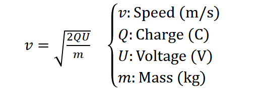
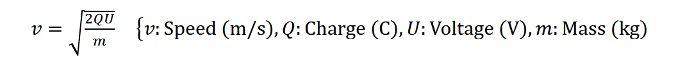
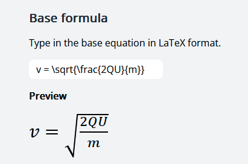
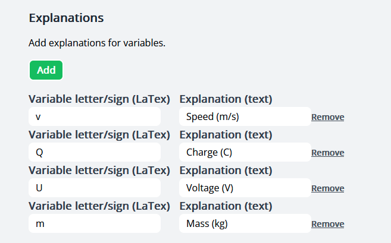
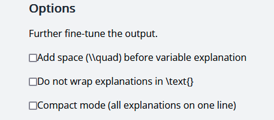
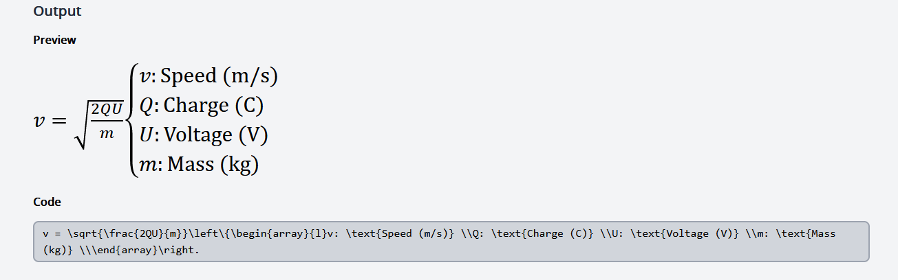

# Formula generator

A quick little utility I wrote in about an hour (and then did some cleanups the day after).

It adds "explanations" to LaTeX formulas, see below.

> **Info**
> 
> Just looking for the website link? Got you! https://formulas.albins.website/ ;)

## The problem

I have digitally taken notes of my formulas used in physics class in LaTeX, but adding explanations
to such formulas would require me to hand-write all this for each formula:
```latex
v = \sqrt{\frac{2QU}{m}}\quad\left\{\begin{array}{l}
v: \text{Speed (m/s)} \\
Q: \text{Charge (C)} \\
U: \text{Voltage (V)} 
\\m: \text{Mass (kg)} \\
\end{array}\right.
```
yielding this result:



Looking at those explanations, take note of how small (in comparison) just the formula is:
```latex
v = \sqrt{\frac{2QU}{m}}
```
I solved this wrote it in a more compact way, but this would cause all the explanations to end up on one singular line:



The code to produce that example is:
```latex
v = \sqrt{\frac{2QU}{m}}\quad\bigl\{v: \text{Speed (m/s)}, Q: \text{Charge (C)}, U: \text{Voltage (V)}, m: \text{Mass (kg)}
```

This was still a little tedious to write, so I created a website to do it for myself!

___

## Tutorial

The website is available at https://formulas.albins.website/ and it is really simple to use.
Just enter the equation. I'll use the one (without explanations) from the example above:



Then, I'll add explanations for each variable:



Finally, I'll look over the settings:



If you're unsure which one to pick, you can click one and the preview below the options will update live
so you can see it if you like it or not. "Compact mode" is my one-liner way to write equation explanations mentioned above.

And then, you get a result and output code to copy and paste!

